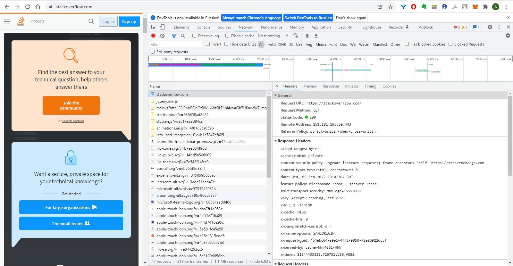
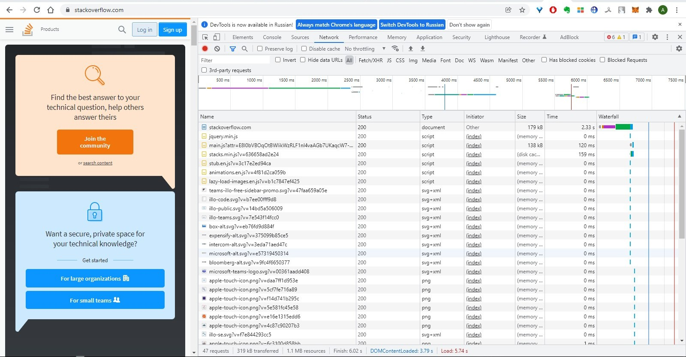
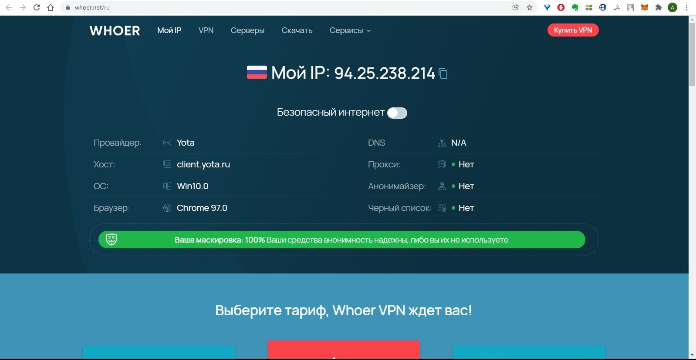
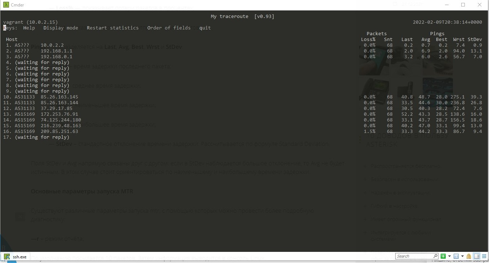

# Домашнее задание к занятию "3.6. Компьютерные сети, лекция 1"

(1) *Задание:*

Работа c HTTP через телнет.
Подключитесь утилитой телнет к сайту stackoverflow.com telnet stackoverflow.com 80
отправьте HTTP запрос
GET /questions HTTP/1.0
HOST: stackoverflow.com
[press enter]
[press enter]

В ответе укажите полученный HTTP код, что он означает?

*Решение:*

```
root@vagrant:~# telnet stackoverflow.com 80
Trying 151.101.1.69...
Connected to stackoverflow.com.
Escape character is '^]'.
GET /questions HTTP/1.0
HOST: stackoverflow.com

HTTP/1.1 301 Moved Permanently
cache-control: no-cache, no-store, must-revalidate
location: https://stackoverflow.com/questions
x-request-guid: 69cc38b8-038c-41d6-a483-0f294bcbdd37
feature-policy: microphone 'none'; speaker 'none'
content-security-policy: upgrade-insecure-requests; frame-ancestors 'self' https://stackexchange.com
Accept-Ranges: bytes
Date: Wed, 09 Feb 2022 18:21:20 GMT
Via: 1.1 varnish
Connection: close
X-Served-By: cache-hhn4082-HHN
X-Cache: MISS
X-Cache-Hits: 0
X-Timer: S1644430880.958478,VS0,VE155
Vary: Fastly-SSL
X-DNS-Prefetch-Control: off
Set-Cookie: prov=5cc84dad-efda-6e87-14ea-5408430fa521; domain=.stackoverflow.com; expires=Fri, 01-Jan-2055 00:00:00 GMT; path=/; HttpOnly
```

Код ошибки 301. Сообщение с кодом 301 Redirect сервер возвращает в том случае, если пользователь либо поисковый робот перенаправляется на URL, отличающийся от того, на который совершается переход. О чем свидетельствует код 301. Эта ошибка указывает на то, что старый адрес утратил свою актуальность, и что содержимое, расположенное по этому адресу, перемещено на другой.


(2) *Задание:*

Повторите задание 1 в браузере, используя консоль разработчика F12.
откройте вкладку Network
отправьте запрос http://stackoverflow.com
найдите первый ответ HTTP сервера, откройте вкладку Headers
укажите в ответе полученный HTTP код.
проверьте время загрузки страницы, какой запрос обрабатывался дольше всего?
приложите скриншот консоли браузера в ответ.

*Решение:*



- код 200




- дольше всего загружался HTML документ - 2,33с

(3) *Задание:*

Какой IP адрес у вас в интернете?

*Решение:*




(4) *Задание:*

Какому провайдеру принадлежит ваш IP адрес? Какой автономной системе AS? Воспользуйтесь утилитой whois

*Решение:*

```
root@vagrant:~# whois 94.25.238.214
% This is the RIPE Database query service.
% The objects are in RPSL format.
%
% The RIPE Database is subject to Terms and Conditions.
% See http://www.ripe.net/db/support/db-terms-conditions.pdf

% Note: this output has been filtered.
%       To receive output for a database update, use the "-B" flag.

% Information related to '94.25.233.0 - 94.25.239.255'

% Abuse contact for '94.25.233.0 - 94.25.239.255' is 'abuse-mailbox@megafon.ru'

inetnum:        94.25.233.0 - 94.25.239.255
netname:        MF-GDC
country:        RU
admin-c:        MA23317-RIPE
tech-c:         MA23317-RIPE
mnt-lower:      GDC-TR-CoreIP
mnt-routes:     GDC-TR-CoreIP
mnt-domains:    MEGAFON-DNS-MNT
mnt-lower:      MEGAFON-AUTO-MNT
status:         LIR-PARTITIONED PA
mnt-by:         MEGAFON-RIPE-MNT
created:        2021-08-20T11:30:07Z
last-modified:  2021-08-20T11:30:07Z
source:         RIPE

role:           Mobile
address:        Samara
nic-hdl:        MA23317-RIPE
mnt-by:         GDC-TR-CoreIP
created:        2020-02-05T11:44:29Z
last-modified:  2020-02-05T11:44:29Z
source:         RIPE # Filtered

% Information related to '94.25.238.0/24AS47395'

route:          94.25.238.0/24
descr:          Tverskaya oblast
origin:         AS47395
mnt-by:         GDC-TR-CoreIP
created:        2014-04-22T09:51:56Z
last-modified:  2021-08-20T11:36:27Z
source:         RIPE

% This query was served by the RIPE Database Query Service version 1.102.2 (ANGUS)
```

Провайдер Yota в сети Megafon. Сеть - AS47395

(5) *Задание:*

Через какие сети проходит пакет, отправленный с вашего компьютера на адрес 8.8.8.8? Через какие AS? Воспользуйтесь утилитой traceroute

*Решение:*

```
root@vagrant:~# traceroute -An 8.8.8.8
traceroute to 8.8.8.8 (8.8.8.8), 30 hops max, 60 byte packets
 1  10.0.2.2 [*]  0.253 ms  0.210 ms  0.194 ms
 2  * * *
 3  * * *
 4  * * *
 5  * * *
 6  * * *
 7  * * *
 8  * * *
 9  * * *
10  * * *
11  * * *
12  * * *
13  * * *
14  * * *
15  * * *
16  * * *
17  * * *
18  * * *
19  * * *
20  * * *
21  * * *
22  * * *
23  * * *
24  * * *
25  * * *
26  * * *
27  * * *
28  * * *
29  * * *
30  * * *
root@vagrant:~# traceroute -AIn 8.8.8.8
traceroute to 8.8.8.8 (8.8.8.8), 30 hops max, 60 byte packets
 1  10.0.2.2 [*]  0.316 ms  0.282 ms  0.275 ms
 2  192.168.1.1 [*]  4.585 ms  4.580 ms  4.648 ms
 3  192.168.0.1 [*]  5.348 ms  6.305 ms  6.304 ms
 4  * * *
 5  * * *
 6  * * *
 7  * * *
 8  * * *
 9  * * *
10  85.26.163.145 [AS31133]  51.438 ms  51.688 ms *
11  * 85.26.163.144 [AS31133]  63.470 ms *
12  37.29.17.85 [AS31133]  525.876 ms  526.427 ms  527.727 ms
13  172.253.76.91 [AS15169]  527.865 ms  528.132 ms  529.462 ms
14  74.125.244.180 [AS15169]  529.711 ms  529.906 ms  529.658 ms
15  216.239.48.163 [AS15169]  564.392 ms  555.243 ms  35.425 ms
16  209.85.251.63 [AS15169]  37.054 ms  36.243 ms  35.363 ms
17  * * *
18  * * *
19  * * *
20  * * *
21  * * *
22  * * *
23  * * *
24  * * *
25  * * *
26  8.8.8.8 [AS15169]  39.038 ms  34.411 ms  35.157 ms
```

Трассировка с помощью UDP не сработала, это может произойти потому, что фаервол блокирует все лишние пакеты. Воспользовался ICMP с помощью опции -I. Пакет проходит через сети: 10, 192, 85, 37, 172, 74, 216, 209. AS: AS31133, AS15169.

(6) *Задание:*

Повторите задание 5 в утилите mtr. На каком участке наибольшая задержка - delay?

*Решение:*



На 10 участке самая большая задержка - 275,1

(7) *Задание:*

Какие DNS сервера отвечают за доменное имя dns.google? Какие A записи? воспользуйтесь утилитой dig

*Решение:*

```
root@vagrant:~# dig +trace @8.8.8.8 dns.google

; <<>> DiG 9.16.1-Ubuntu <<>> +trace @8.8.8.8 dns.google
; (1 server found)
;; global options: +cmd
.                       18660   IN      NS      g.root-servers.net.
.                       18660   IN      NS      b.root-servers.net.
.                       18660   IN      NS      l.root-servers.net.
.                       18660   IN      NS      k.root-servers.net.
.                       18660   IN      NS      d.root-servers.net.
.                       18660   IN      NS      h.root-servers.net.
.                       18660   IN      NS      m.root-servers.net.
.                       18660   IN      NS      e.root-servers.net.
.                       18660   IN      NS      i.root-servers.net.
.                       18660   IN      NS      c.root-servers.net.
.                       18660   IN      NS      a.root-servers.net.
.                       18660   IN      NS      j.root-servers.net.
.                       18660   IN      NS      f.root-servers.net.
.                       18660   IN      RRSIG   NS 8 0 518400 20220221170000 20220208160000 9799 . B2wjK1eR1P1aFoiGZPD3QC3ltGZOUJC5VjVssGfuxBzm8JL/T9lm5q6h Pczll0BzbAlZirHfE9OrfPw688vHaQ1OvR4IM/mdYaH1ypSxRTpEGN2k GV+tyPLgDbBhkfmLklLxXIRO3U43hxn7gFtbaXAbQ8Hdp2rKIkMy0fHS b4djhapstSd1cH+tKdiNUR7xTupfNjhc5hQM8V4q0HssQ1wlpActyImi Z5qjci2gahdEpa1N3/Tzric6eS8fGtxjEtKuBXsMqlnhg+pJsQ2eHXvn 3VdPJg89gvDk4TDf0WDSt2ZeDIfZ3dHwz3PkTMlbpmDY1Iqqudoz1cjv YU8dcw==
;; Received 525 bytes from 8.8.8.8#53(8.8.8.8) in 52 ms

google.                 172800  IN      NS      ns-tld1.charlestonroadregistry.com.
google.                 172800  IN      NS      ns-tld2.charlestonroadregistry.com.
google.                 172800  IN      NS      ns-tld3.charlestonroadregistry.com.
google.                 172800  IN      NS      ns-tld4.charlestonroadregistry.com.
google.                 172800  IN      NS      ns-tld5.charlestonroadregistry.com.
google.                 86400   IN      DS      6125 8 2 80F8B78D23107153578BAD3800E9543500474E5C30C29698B40A3DB2 3ED9DA9F
google.                 86400   IN      RRSIG   DS 8 1 86400 20220222170000 20220209160000 9799 . ZVmOvfho1EiGlxX/gcF8aMgxGGHxuLu7Ac2d/UP62xwj6RgoUO2GdHQD 6dBfaoZ1/tS0+4ci8Xbp4WZIwFJsLV8KWwZy/aHuHvwuspYsvdakUnRD GgrcsX9mbvcwIIH8L4poWN0cX1UIW7SzORsTbkXY6a5wcCCFU96XI9qY K8ln0V1k1QH8UURRACE+dK/GbFHQihDWIcBf6+cPD2u+d7SgIsG38yk1 M97BH5roVbXQ59PfNXB2yAS4MA07+S0SBjr8K9LSbXedfLOzl26BPKMF xw3V2GnQ98S1kFnIjy7Y/sEVDAz9kjTvp9XjggNLo0vh9Gk9qxa4zjdP SdNMYA==
;; Received 730 bytes from 198.97.190.53#53(h.root-servers.net) in 64 ms

dns.google.             10800   IN      NS      ns4.zdns.google.
dns.google.             10800   IN      NS      ns3.zdns.google.
dns.google.             10800   IN      NS      ns2.zdns.google.
dns.google.             10800   IN      NS      ns1.zdns.google.
dns.google.             3600    IN      DS      56044 8 2 1B0A7E90AA6B1AC65AA5B573EFC44ABF6CB2559444251B997103D2E4 0C351B08
dns.google.             3600    IN      RRSIG   DS 8 2 3600 20220302182859 20220208182859 39106 google. P4AxpPShH0+rAol37rX0myfKtKajydqbCbMFIg4L9SnboAx5R7ROnwrw 5USR7gFEHRc9aEm+O2/TmcpivMuGRsS6JvCMbqqlsAtrcMGmK8nabCXu yc82ipF67HTJwKmSO7t4YU/4ZBvdYDR9uolaN6UJJ2Gwtbfee2Qg4RoI 5tw=
;; Received 506 bytes from 216.239.60.105#53(ns-tld5.charlestonroadregistry.com) in 184 ms

dns.google.             900     IN      A       8.8.4.4
dns.google.             900     IN      A       8.8.8.8
dns.google.             900     IN      RRSIG   A 8 2 900 20220301194556 20220207194556 25800 dns.google. voKTmdCkO3DRupZHZ+LC6VTDV4UQkBdnidvQSJE/E5zZYWUI4YWTiOeD wuKgiHLdJTbGEZ9aF4s/JCzwKG7Vjy0aw4RM97XNNRNgy/nDMbVThIVx IK6L85Jfn7gtrqlVzOc8gXC1CwEt0ufsFU2c2MSjDcjSQCilICKCu09v vuw=
;; Received 241 bytes from 216.239.36.114#53(ns3.zdns.google) in 60 ms
```

За доменное имя dns.google отвечают сервера ns1.zdns.google. ns2.zdns.google. ns3.zdns.google. ns4.zdns.google. А записи: 8.8.4.4, 8.8.8.8

(8) *Задание:*

Проверьте PTR записи для IP адресов из задания 7. Какое доменное имя привязано к IP? воспользуйтесь утилитой dig

*Решение:*

```
root@vagrant:~# dig -x 8.8.8.8

; <<>> DiG 9.16.1-Ubuntu <<>> -x 8.8.8.8
;; global options: +cmd
;; Got answer:
;; ->>HEADER<<- opcode: QUERY, status: NOERROR, id: 18382
;; flags: qr rd ra; QUERY: 1, ANSWER: 1, AUTHORITY: 0, ADDITIONAL: 1

;; OPT PSEUDOSECTION:
; EDNS: version: 0, flags:; udp: 65494
;; QUESTION SECTION:
;8.8.8.8.in-addr.arpa.          IN      PTR

;; ANSWER SECTION:
8.8.8.8.in-addr.arpa.   2557    IN      PTR     dns.google.

;; Query time: 0 msec
;; SERVER: 127.0.0.53#53(127.0.0.53)
;; WHEN: Wed Feb 09 21:16:02 UTC 2022
;; MSG SIZE  rcvd: 73

root@vagrant:~# dig -x 8.8.4.4

; <<>> DiG 9.16.1-Ubuntu <<>> -x 8.8.4.4
;; global options: +cmd
;; Got answer:
;; ->>HEADER<<- opcode: QUERY, status: NOERROR, id: 3511
;; flags: qr rd ra; QUERY: 1, ANSWER: 1, AUTHORITY: 0, ADDITIONAL: 1

;; OPT PSEUDOSECTION:
; EDNS: version: 0, flags:; udp: 65494
;; QUESTION SECTION:
;4.4.8.8.in-addr.arpa.          IN      PTR

;; ANSWER SECTION:
4.4.8.8.in-addr.arpa.   1919    IN      PTR     dns.google.

;; Query time: 40 msec
;; SERVER: 127.0.0.53#53(127.0.0.53)
;; WHEN: Wed Feb 09 21:16:24 UTC 2022
;; MSG SIZE  rcvd: 73
```

Доменное имя привязанное к IP  - dns.google
